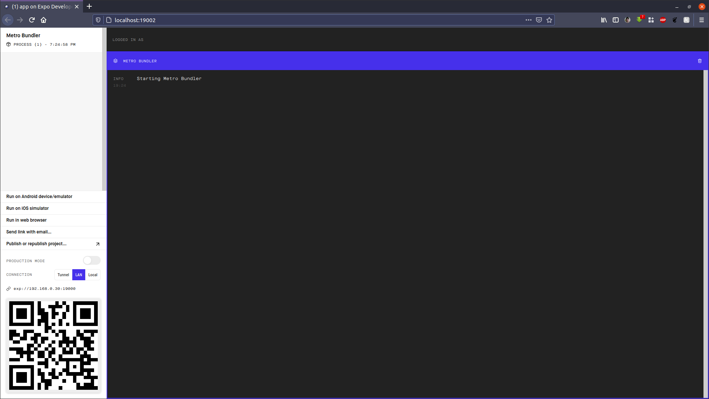
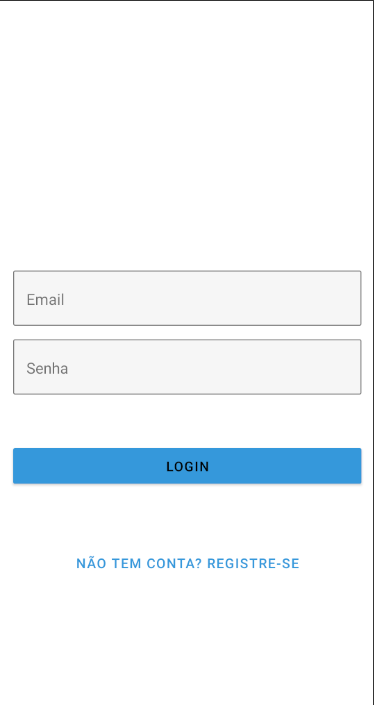
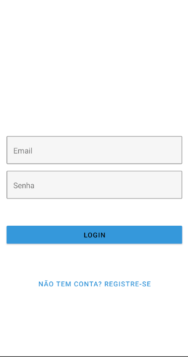
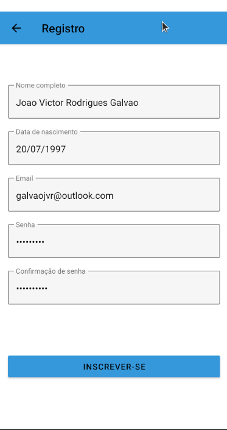
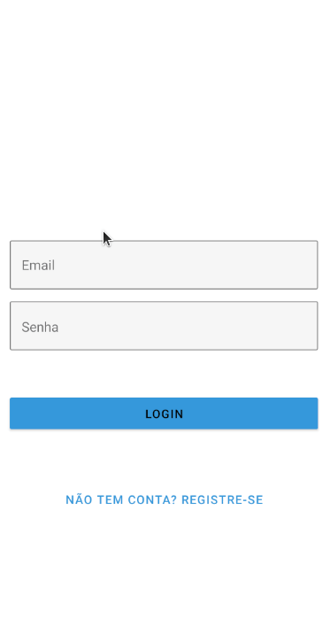
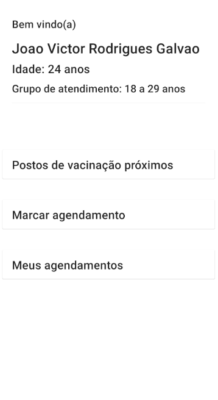
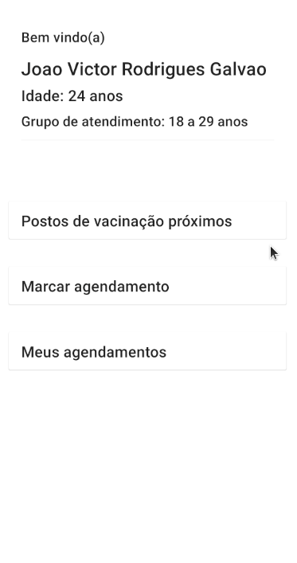
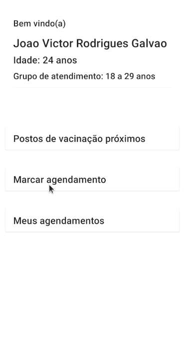
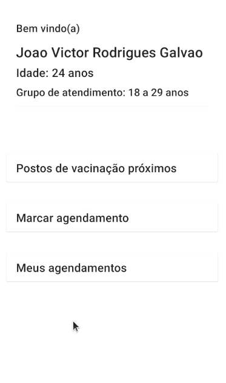
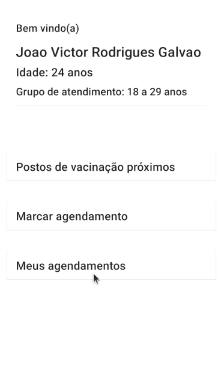

# projeto_v_dispositivos_moveis

Seleção para o Edital 43/2021 do Laboratório de Inovação Tecnológica em Saúde

Criar  um  aplicativo  móvel  para  Android  ou  iOS  voltado  para  a  campanha  de  vacinação 
contra covid-19 que permita ao cidadão realizar o seu cadastro e escolher local, dia e horário 
para  a  vacinação.  Além  disso,  o  sistema  deve  permitir  que  a  população  em  geral  possa 
acompanhar a transparência dos agendamentos realizados.

# Índice
+ [Configurando o ambiente](#configuracao)
+ [Aplicativo](#aplicativo)
    - [Rota do Neurologista](#neurologista)
    - [Rota do Cuidador](#cuidador)
+ [Melhorias e ideias](#melhorias)

<h1 id="configuracao">Configurando o ambiente</h2>

Para a execução desse projeto, é necessária a instalação de certos pacotes para que tudo funcione como deve.

Para a api, basta seguir as instruções no seguinte endereço.

`https://github.com/allysonbarros/lais-edital-43-2021-react-native`

Para o aplicativo, basta seguir o seguinte tutorial, nele está explicado como configurar o ambiente android, com emulador.

`https://react-native.rocketseat.dev/android/linux/`

Após a configuração do ambiente, é necessário instalar o Expo, para isto basta digitar no terminal:

`npm install --global expo-cli`

Quando acabar a instalação executar o comando `expo start` na pasta do projeto.

A seguinte janela irá se abrir no navegador e será possível abrir emuladores por ela, ou escanear o qrcode para abrir o aplicativo no próprio dispositivo pelo aplicativo `Expo Go`

    

        
    
Figura 1. Expo Developer

    

<h1 id="aplicativo">O aplicativo</h2>

    

        
    
Figura 2. Tela inicial

    

O aplicativo foi desenvolvido utilizando React Native, TypeScript e Expo.

Além também de algumas bibliotecas como [DateTimePicker](https://github.com/react-native-datetimepicker/datetimepicker), [Date-fns](https://date-fns.org/), [geolocation](https://github.com/react-native-geolocation/react-native-geolocation), [Picker](https://github.com/react-native-picker/picker), [React Navigation](https://reactnavigation.org/), [Axios](https://github.com/axios/axios), [haversine-distance](https://www.npmjs.com/package/haversine-distance), [React Native Paper](https://callstack.github.io/react-native-paper/index.html).

A implementação partiu das orientações do edital, se iniciando pela já mostrada tela de login, com os campos de login e botões, um para realizar o login e outro para se registrar, caso não haja conta.

    

        
    
Figura 3. Tela de registro

    

Ao preencher os campos corretamente é possível se registrar e após o registro retorna para a tela de login.

    

        
    
Figura 4. Registro

    

Após o registro é possível fazer login.

    

        
    
Figura 5. Login

    

    

        
    
Figura 6. Home

    

Ao abrir os postos de vacinação, será exibida uma lista de locais, ordenados por distância da sua localização atual. Só são exibidos os locais da sua cidade.

    

        
    
Figura 7. Locais

    

Outra tela disponivel é a de agendamentos, nela você preenche os campos de data, hora, local e dose à agendar.

    

        
    
Figura 8. Agendamento

    

Preenchendo as informações é possível fazer o agendamento.

    

        
    
Figura 9. Agendando

    

Caso já haja um agendamento com o status agendado, é exibido um alerta.

    

        
    
Figura 10. Agendamento negado

    

Também é possível visualizar os agendamentos já feitos.

    

        
    
Figura 11. Meus agendamentos

    

Por ser uma prova de conceito, optei por não estilizar (por falta de talento com ux/ui) e também o código não está muito bonito e tão eficiente, algumas das melhorias que poderiam ser feitas seria o uso da context api do react, para compartilhamento global de variáveis descartando a repetição do código.